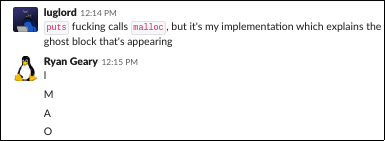

# malloc, or how I learned to stop debugging with printf

All of the code referenced in this talk is on hosted on my
[github page](https://github.com/crclark96/myalloc)

## pointers

Pointers are special variables that aren't *really* variables per se

They only show up in languages with manual memory management
(C, C++, Ada, Go, etc.) because they're used to manually manage memory
in ways that Java and Python don't allow.

Pointers refer to the location of a variable in memory. The type of
pointer specifies what is at that location. You can think of pointers
as addresses (which they are, for the most part). My address tells you
where to find my house, but it isn't my actual house. Going there and
changing what my house looks like (by painting the walls or mowing the
lawn) is something you have to do by yourself.

In C pointers are declared using the `*` symbol.

```c
int *pc; // this declares a pointer that holds the address of an int
int c; // this declares an int
int b,*pb;
/*
 * you can also declare pointers with comma notation alongside variables
 *  of the same type as the pointer
 *
 * note that an int * is not a different type than an int. this is weird
 *  but cool
 */

c = 10; // this changes the value of c
pc = &c;
// this sets pc to point to c. & is the "reference operator"
*pc = 6; // this changes the value of the object at pc
// * is the dereference operator (this is confusing but fine)

/*
 * c == 6
 */

```

## the stack vs the heap

### local vars vs dynamic memory

Most of the time when you want a variable you just instantiate it
but you don't really care where the computer stores it. This is fine,
but not always what we want.

Any variable declared in a normal function goes on the stack,
which is local to that function. Once the function exits, the variable
is deleted and the computer lets other things use that space in memory.

If we want to keep things that are too big to pass around on the stack
(think big structs, objects if you're into C++, that kind of thing),
we stick them on a special place in memory called the heap, which
doesn't automatically delete things.

This is called dynamic memory because it's allocated dynamically at
runtime.

## malloc

`malloc()` is the function that dynamically allocates memory in C.

```c
void *p;
p = malloc(41); // p now points to 41 bytes of memory on the heap
```

`malloc()` has a very important partner, `free()`.

```
void *p;
p = malloc(30283); // we need a LOT of space for something
...
free(p); // make sure we give it back though
```

Free as in malloc is also a good blog that you should read.

There are other mallocs, which do cool things like:

  * make sure the memory you ask for doesn't have garbage data in it
  * make sure the memory you ask for does have garbage in it, but garbage
  that you specifically ask for
  * take your memory and give you a bigger memory, because you asked
  for the wrong size

## malloc implementation

### how to get more space

Your program has different sections for different types of memory:

  * the actual code (.text)
  * global variables and static variables (.data)
  * uninitialized data (.bss)
  * the stack & heap
  * commandline args, environment variables, etc

When loaded into memory, it looks like this:

```
+------------------+ 0xffffffff
|                  |
| commandline args |
| environment vars |
| etc.             |
|                  |
+------------------+
|                  |
| stack            |
|                  |
+------------------+
|        |         |
|        |         |
|        v         |
|                  |
|                  |
|        ^         |
|        |         |
|        |         |
+------------------+
|                  |
| heap             |
|                  |
+------------------+
|                  |
| .bss             |
|                  |
+------------------+
|                  |
| .data            |
|                  |
+------------------+
|                  |
| .text            |
|                  |
+------------------+ 0x00000000

```

There's a cool syscall called `brk` that moves the end of the .bss
section to whatever address you give it. Under the hood, `malloc()`
uses this to increase the .bss section size to fit any dynamic memory
you might need

```c
struct block_meta *request_space(struct block_meta *last, size_t size){
  struct block_meta *block;
  block = sbrk(0); // current program break
  void *request = sbrk(size + META_SIZE);
  assert((void*)block == request); // not thread safe
  if(request == (void*) -1){
    return NULL;
  }

  if(last) { // NULL on first request
    last->next = block;
  }
  block->size = size;
  block->next = NULL;
  block->free = 0;
  block->magic = 0x12345678;
  return block;
}

```

### what to do with old space

Unlike the stack, we don't know when memory is going to be freed,
so we can't just move the program break (the end of the .bss segment)
back and forth willy-nilly, otherwise we risk abandoning some memory
that's still in use

Instead, as you might have gathered from the code demonstrating
`sbrk()` to increase the .bss, dynamic memory is stored as a linked
list, with metadata at the beginning that looks like this:

```c
struct block_meta{
  size_t size;
  struct block_meta *next;
  int free;
  int magic; // debugging only TODO: remove this
};
```

When we free a block of dynamic memory, all we have to do is set the
`free` field to 1 (or a nonzero value).

```c
void free(void *ptr){
  if (!ptr){
    return;
  }

  // TODO: consider merging blocks once splitting blocks is implemented
  struct block_meta* block_ptr = get_block_ptr(ptr);
  assert(block_ptr->free == 0);
  assert(block_ptr->magic == 0x77777777 || block_ptr->magic == 0x12345678);
  block_ptr->free = 1;
  block_ptr->magic = 0x55555555;
}
```

### actual malloc internals

```c
void *malloc(size_t size){
  struct block_meta *block; // TODO: align size?

  if (size <= 0) {
    return NULL;
  }

  if (!global_base) { // first call
    block = request_space(NULL, size);
    if (!block) {
      return NULL;
    }
    global_base = block;

  } else {
    struct block_meta *last = global_base;
    block = find_free_block(&last, size); // traverse the heap

    if (!block) {
      return NULL;

    } else { // found free block
      // TODO: consider splitting free block here
      block->free = 0;
      block->magic = 0x77777777;
    }
  }
  return (block+1); // return pointer to space after metadata block
}
```

When you ask for space, malloc traverses the list of blocks
and tries to find a free one that is large enough. If none of
the blocks satisfy this requirement, it creates a new block at the
end of the .bss section and adds that to the list.

More comprehensive mallocs will merge adjacent blocks and split
blocks that are too large, in order to minimize the amount of empty
space on the heap.

### demo

I added a nice function that prints the entire heap, which we can
use to visualize exactly what's going on here:

```c
#include "malloc.h"

int main() {
  void *ptr0 = malloc(16);
  show_heap();
  free(ptr0);
  show_heap();
  return 0;
}
```

The blocks have a magic number that lets us know their status as well,
here's the key:

  - `0x12345678` = brand new block of requested space
  - `0x77777777` = old block of space that's being reallocated
  - `0x55555555` = block of space that has been freed

```
$ ./demo

~~~~~~~~~~~~~~~~~~~~~~~~~~~~~~~~~~~~~~~~~~~~~~~~~~~~~~~~~~~
    heap start
~~~~~~~~~~~~~~~~~~~~~~~~~~~~~~~~~~~~~~~~~~~~~~~~~~~~~~~~~~~
*-------------------------------------------------*   |
| addr  -> 0x555555758000                         | <-+
| size  ->     0x00000010                         |
| free  ->              0                         |
| magic ->     0x12345678                         |
| next  -> 0x555555758028                         | --+
*-------------------------------------------------*   |
| contents:                                       |   |
|  0  1  2  3  4  5  6  7  8  9  a  b  c  d  e  f |   |
| 00 00 00 00 00 00 00 00 00 00 00 00 00 00 00 00 |   |
|                                                 |   |
*-------------------------------------------------*   |
*-------------------------------------------------*   |
| addr  -> 0x555555758028                         | <-+
| size  ->     0x00000400                         |
| free  ->              0                         |
| magic ->     0x77777777                         |
| next  ->          (nil)                         | --+
*-------------------------------------------------*   |
| contents:                                       |   |
|  0  1  2  3  4  5  6  7  8  9  a  b  c  d  e  f |   |
| 7c 20 37 63 20 32 30 20 33 37 20 36 33 20 32 30 |   |
| 20 33 32 20 33 30 20 32 32 20 33 32 20 32 30 20 |   |
| 33 33 20 33 32 20 32 30 20 33 32 20 33 30 20 32 |   |
| 32 20 7c 20 20 20 7c 0a 00 00 00 00 00 00 00 00 |   |
| 00 00 00 00 00 00 00 00 00 00 00 00 00 00 00 00 |   |
|                                                 |   |
*-------------------------------------------------*   |

~~~~~~~~~~~~~~~~~~~~~~~~~~~~~~~~~~~~~~~~~~~~~~~~~~~~~~~~~~~
    heap start
~~~~~~~~~~~~~~~~~~~~~~~~~~~~~~~~~~~~~~~~~~~~~~~~~~~~~~~~~~~
*-------------------------------------------------*   |
| addr  -> 0x555555758000                         | <-+
| size  ->     0x00000010                         |
| free  ->              1                         |
| magic ->     0x55555555                         |
| next  -> 0x555555758028                         | --+
*-------------------------------------------------*   |
| contents:                                       |   |
|  0  1  2  3  4  5  6  7  8  9  a  b  c  d  e  f |   |
| 00 00 00 00 00 00 00 00 00 00 00 00 00 00 00 00 |   |
|                                                 |   |
*-------------------------------------------------*   |
*-------------------------------------------------*   |
| addr  -> 0x555555758028                         | <-+
| size  ->     0x00000400                         |
| free  ->              0                         |
| magic ->     0x77777777                         |
| next  ->          (nil)                         | --+
*-------------------------------------------------*   |
| contents:                                       |   |
|  0  1  2  3  4  5  6  7  8  9  a  b  c  d  e  f |   |
| 7c 20 37 63 20 32 30 20 33 37 20 36 33 20 32 30 |   |
| 20 33 32 20 33 30 20 32 32 20 33 32 20 32 30 20 |   |
| 33 33 20 33 32 20 32 30 20 33 32 20 33 30 20 32 |   |
| 32 20 7c 20 20 20 7c 0a 00 00 00 00 00 00 00 00 |   |
| 00 00 00 00 00 00 00 00 00 00 00 00 00 00 00 00 |   |
|                                                 |   |
*-------------------------------------------------*   |
```

### printf

You're probably trying to figure out exactly why there are two
blocks on the heap instead of one, considering we definitely only
call `malloc()` exactly one time in this very short piece of code.

So am I.

This took me about two weeks to understand, and it was really annoying
because I originally didn't limit the size of the blocks that were
being printed, so I had this massive `0x400` byte block swamping my
terminal buffer.

I tried everything, I had print statements everywhere, and still this
block of memory would just appear randomly. Gdb was absolutely no
help whatsoever. On one line, the pointer to the next memory block
was `NULL`, and on the next it would suddenly be populated and I had
no idea how.

It wasn't until I put on my "crazy person who spent the entire night
dreaming about debugging and then read three pages of compiler
optimization flags" hat that I dove into the actual disassembly
of the binary only to find this beautiful snippet of code in the
glibc source code:

```c

194 /* The function itself.  */
195 int
196 vfprintf (FILE *s, const CHAR_T *format, va_list ap)
197 {
198   /* The character used as thousands se

...

1460           if (__libc_use_alloca (needed))
1461               workend = (CHAR_T *) alloca (needed) + width + 32;
1462             else
1463               {
1464                 workstart = (CHAR_T *) malloc (needed);
1465                 if (workstart == NULL)
1466                   {
1467                     done = -1;
1468                     goto all_done;
1469                   }
1470                 workend = workstart + width + 32;
1471               }
1472           }
```

That's right, `vfprintf()`, which is wrapped by `printf()`,
__calls malloc__. And it was calling my malloc.




### shared objects and LD_PRELOAD

Now comes the coolest part (in my opinion). If you checked the makefile
for corresponding project code, you'll see that I'm compiling my code
with the `-fPIC` option, which makes the resulting code position
independent. This enables the code to be loaded at any address in
memory and still be executed correctly.

This is important for code like `malloc()` since, ideally, this code
will be loaded into memory and shared among all of the different programs
that need malloc when they run. These are called dynamic libraries,
and there should be one called `malloc.so` in the directory after
building the project.

Now that we have our own malloc, we definitely want to use it live,
in programs that use malloc, without changing the underlying program.
The best way to do this is using the `LD_PRELOAD` variable, and pointing
it at `malloc.so`, which loads our malloc first, before the default one.

```
$ time LD_PRELOAD=$(pwd)/malloc.so gcc -march=native -fPIC -Wall -Wshadow -g -O0 -o demo demo.o malloc.o

LD_PRELOAD=$(pwd)/malloc.so gcc -march=native -fPIC -Wall -Wshadow -g -O0 -o   0.04s user 0.00s system 95% cpu 0.041 total

$ time gcc -march=native -fPIC -Wall -Wshadow -g -O0 -o demo demo.o malloc.o

gcc -march=native -fPIC -Wall -Wshadow -g -O0 -o demo demo.o malloc.o  0.03s user 0.00s system 99% cpu 0.030 total
```

As you can see, there's a little more overhead using our malloc
(whoops!), but it's still really cool to see our malloc in action
with a project as big as gcc.

`LD_PRELOAD` is really cool.

### for fun

I've also implemented `realloc()` and `calloc()` within the malloc.c
file, but there are other cool things you can do once you know what's
happening under the hood. I have a few ideas for great new malloc
flavors, so if you're looking for a great resume line item, definitely
consider trying to build one of these:

  - mallawk - malloc, but it's written in awk somehow
    (I don't think this is actually possible)
  - phalloc - malloc, but the returned space is preset to an unwanted
    photograph
  - djkhalloc - malloc returns a pointer, and then another one
  - oc - malloc that prints out some fresh original content
